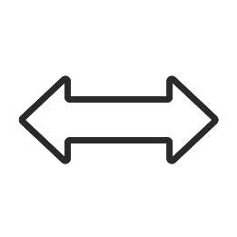

# v0.1.0

## 1. MAPA

Mapa składa się z następujących pól:

- Trawa 

- Woda 

- Skała 

## 2. RUCH JEDNOSTKI

### 2.1 Wykonanie ruchu

- Ruch może odbywać się jedynie na sąsiadujące pole, niemożliwy jest ruch po skosie.
- Jednostka może poruszać się maksymalnie o tyle pól, ile wynosi jej **Ruch**.

  Dozwolony ruch:

  

  Niedozwolony ruch:

  

### 2.2 Ruch jednostki lądowej

| Żeton                                       | Nazwa     | Możliwy ruch | Koszt |
| ------------------------------------------- | --------- | ------------ | ----- |
|    | Piechota  | 2            | 1     |
|    | Strzelcy  | 2            | 1     |
|  | Kawaleria | 3            | 2     |

Jednostki lądowe mogą poruszać się po następujących polach:

- **Trawa**
- **Jednostki Oblężnicze**
- **Jednostki Wodne**
- **Mury** – mogą wchodzić na mury jedynie z sąsiadujących **Murów, Drabin, Wież oblężniczych i Bram**
- **Drabiny**
- **Bramy** – mogą poruszać się tylko przez sojusznicze bramy (o kolorze gracza)

### 2.3 Ruch jednostki oblężniczej

| Żeton                                           | Nazwa   | Możliwy ruch | Koszt |
| ----------------------------------------------- | ------- | ------------ | ----- |
|          | Wieża   | 1            | 4     |
|              | Taran   | 1            | 4     |
|  | Trebusz | 1            | 4     |

Jednostki oblężnicze mogą poruszać się po następujących polach:

- **Trawa**
- **Jednostki Wodne**
- **Bramy** – mogą poruszać się tylko przez sojusznicze bramy (o kolorze gracza)

Obrót:

- Zamiast ruchu można dokonać obrotu.
- Dozwolone są następujące kombinacje obrotu:

 { width="100" } 

 { width="100" } 

 { width="100" } 

 { width="100" } 

### 2.4 Ruch jednostki wodnej

| Żeton                                                | Nazwa  | Możliwy ruch | Koszt |
| ---------------------------------------------------- | ------ | ------------ | ----- |
| { width="220" } | Statek | 3            | 4     |

- Jednostki wodne mogą poruszać się jedynie po wodzie
- Ruch jednostki wodnej jest niemożliwy, jeśli jakaś jednostka oblężnicza znajduje się na niej nie w pełni

Obrót:

- Zamiast ruchu można dokonać obrotu.
- Dozwolone są następujące kombinacje obrotu:

 { width="100" } 

 { width="100" } 

## 3. AKCJA JEDNOSTKI

### 3.1 Akcja jednostki lądowej

**Piechota** - w ramach akcji może zlikwidować sąsiednią, przeciwną jednostkę lądową.

**Kawaleria** - w ramach akcji może zlikwidować sąsiednią, przeciwną jednostkę lądową.

**Łucznicy** - w ramach akcji może spróbować zlikwidować przeciwną jednostkę lądową, która znajduje się w zasięgu.

- Przed strzałem należy zadeklarować, w którą jednostkę strzelamy.
- Jeśli strzelec znajduje się na **murze lub wieży**, a przeciwna jednostka nie, odległość liczona jest jak **o 1 mniejsza**.
- Jeśli **przeciwna** jednostka znajduje się na **murze lub wieży**, a strzelec nie, odległość liczona jest jak **o 1 większa**.

Warunki likwidacji wrogiej jednostki przez łuczników:

- Odległość przeciwnika **mniejsza/równa 2**
- Wyrzucenie **5 lub 6 na kostce**

### 3.2 Akcja jednostki oblężniczej

**Wieża** – w ramach akcji pozwala wykonać akcję wszystkich, niewyczerpanych jednostek wewnątrz.

**Taran** – w ramach akcji może spróbować zniszczyć sąsiadujący **mur** lub inną **budowlę**:

- Można próbować zniszczyć wszystkie budowle poza Zamkiem i Obozem.
- Po zniszczeniu budowli należy usunąć jej żeton oraz ewentualnie żetony wszystkich innych jednostek, które się na niej znajdowały.

Warunki likwidacji wrogiej jednostki przez Taran:

- Aby zniszczyć **mur** należy wyrzucić **5 lub 6 na kostce**.
- Aby zniszczyć **inna budowlę** należy wyrzucić **4, 5 lub 6 na kostce**.
- Taran musi być skierowany poziomo do budowli, którą ma zniszczyć

Trebusz – w ramach akcji może spróbować zniszczyć inną jednostkę, która jest w zasięgu.

- Po zniszczeniu jednostki należy usunąć jej żeton oraz ewentualnie wszystkich innych jednostek, które się na niej znajdowały.

Warunki likwidacji wrogiej jednostki przez Trebusz

- Trebusz musi być skierowany poziomo w stronę strzału.
- Rzuty **4/5/6** trafiają cel, który znajduje się na danej kratce (tak jak na rysunku poniżej), nawet jeśli jest to sojusznik.

## 4. TURA JEDNOSTKI

### 4.1 Tura jednostki lądowej

Warunki rozpoczęcia tury:

- Jednostka lądowa jest niewyczerpana.

Tura przebiega następująco:

- Wybieramy jednostkę, której turę chcemy rozegrać.
- Opcjonalnie, wykonujemy ruch jednostki.
- Opcjonalnie, wykonujemy akcję jednostki.
- Oznaczamy jednostkę jako wyczerpaną.

### 4.2 Tura jednostki oblężniczej

Warunki rozpoczęcia tury:

- Wewnątrz przebywa przynajmniej jedna, niewyczerpana jednostka lądowa.
- Wewnątrz nie znajduje się żadna wroga jednostka.

Tura przebiega następująco:

- Wybieramy jednostkę, której turę chcemy rozegrać.
- Opcjonalnie, wykonujemy ruch jednostki. Powoduje to wyczerpanie jednej, dowolnej jednostki lądowej w środku.
- Opcjonalnie, jeśli wewnątrz znajduje się niewyczerpana jednostka lądowa, wykonujemy akcję jednostki.
- Wyczerpujemy wszystkie jednostki lądowe w środku.

### 4.3 Tura jednostki wodnej

Warunki rozpoczęcia tury:

- Wewnątrz przebywa przynajmniej jedna, niewyczerpana jednostka lądowa.
- Wewnątrz nie znajduje się żadna wroga jednostka.

Tura przebiega następująco:

- Wybieramy jednostkę, której turę chcemy rozegrać.
- Opcjonalnie, wykonujemy ruch jednostki. Powoduje to wyczerpanie jednej, dowolnej jednostki lądowej w środku.
- Opcjonalnie, możemy wykonać tury pozostałych jednostek, które znajdują się w środku.
- Wyczerpujemy wszystkie jednostki lądowe w środku.

## 5. BUDYNKI

| Żeton                                         | Nazwa    | Koszt | Maksymalna odległość budowy |
| --------------------------------------------- | -------- | ----- | --------------------------- |
|      | Zamek    | -     | -                           |
|  | Koszary  | 8     | 5                           |
|  | Warsztat | 8     | 5                           |
|          | Port     | 8     | 5                           |
|          | Obóz     | 32    | 20                          |
|        | Mur      | 4     | 10                          |
|          | Brama    | 4     | 10                          |
|      | Drabina  | 1     | 10                          |

### 5.1 Zamek

W ramach **akcji** pozwala wybudować dowolny **budynek** lub pozyskać **4 monety**.

- Aby wybudować budynek, należy zapłacić jego **koszt**.
- Nowo wybudowana budowla, musi spełniać zasadę **maksymalnej odległości** od zamku.
- Nie ma możliwości wybudowania nowego zamku.
- Wszystkie budynki można budować tylko i wyłącznie na **trawie**.
- Aby port mógł spełniać swoją akcję, powinien on być wybudowany w sąsiedztwie wody. Warto, aby obóz również był w sąsiedztwie wody.

### 5.2 Koszary

W ramach akcji pozwalają stworzyć maksymalnie **2 jednostki lądowe**.

- Aby stworzyć jednostki, należy zapłacić ich **koszt**.
- Nowo powstałe jednostki muszą znajdować się **w sąsiedztwie** koszar.
- Jednostkę można ustawić na tych polach, na które może się ona normalnie ruszać.

### 5.3 Warsztat

W ramach akcji pozwala stworzyć maksymalnie **1 jednostkę oblężniczą**.

- Aby stworzyć jednostkę, należy zapłacić jej **koszt**.
- Nowo powstała jednostka musi znajdować się **w sąsiedztwie** warsztatu.
- Jednostkę można ustawić na tych polach, na które może się ona normalnie ruszać.

### 5.4 Port

W ramach akcji pozwala stworzyć maksymalnie **1 jednostkę wodną**.

- Aby stworzyć jednostkę, należy zapłacić jej **koszt**.
- Nowo powstała jednostka musi znajdować się **w sąsiedztwie** portu.
- Jednostkę można ustawić jedynie na wodzie.

### 5.5 Obóz

W ramach akcji pozwala wykonać jedną z akcji **koszar, warsztatu lub portu**.

### 5.6 Mur, brama i drabina

Te budynki nie posiadają akcji.

- Mur oraz brama, blokują możliwość przejścia wrogich jednostek.
- Mur (tak jak wieża oblężnicza) daje przewagę strzelcom, którzy się na nim znajdują.
- Na mur można wejść jedynie z innego **muru, drabiny, bramy lub wieży oblężniczej**.
- Przez bramę mogą przechodzić jedynie sojusznicze jednostki.

## 6. PRZEJMOWANIE ZAMKU I OBOZU

Wrogie zamki i obozy można przejąć.

- Aby przejąć wrogi zamek lub obóz, w ich sąsiedztwie muszą znajdować się przynajmniej **3 jednostki lądowe** osoby przejmującej i nie może znajdować się żadna jednostka lądowa właściciela zamku / obozu.
- Po przejęciu zamku, wszystkie należące do niego budynki (poza obozem), należą teraz do gracza przejmującego i może z nich korzystać jak ze swoich.

## 7. PRZYGOTOWANIE DO GRY

### 7.1 Standardowy tryb gry

1. Gracze otrzymują po 64 monety.
2. Pierwszy gracz stawia zamek.
3. Drugi gracz stawia zamek w odległości minimum 16 pól od wrogiego zamku.
4. Drugi gracz rozpoczyna rozgrywkę turową.

### 7.2 Tryb oblężniczy

W tym trybie gry zamek zamiast swojej standardowej akcji, produkuje tylko **jedną monetę dziennie**.

Gracz atakujący musi jak najszybciej zdobyć zamek, ponieważ gracz broniący ciągle będzie się bogacił.

1. Gracz broniący i atakujący otrzymują po 64 monety.
2. Gracz broniący stawia zamek.
3. Gracz broniący buduje dowolną liczbę budynków, zgodnie ze standardowymi zasadami.
4. Gracz atakujący stawia 2 darmowe obozy w odległości minimum 16 pól od wrogiego od zamku.
5. Gracz atakujący rozpoczyna rozgrywkę turową.

## 8. ROZGRYWKA TUROWA

Każdy gracz w swojej turze wykonuje po kolei następujące akcje:

- Wykonanie tur jednostek, tak aby je wszystkie wyczerpać.
- Akcja budynków.

## 9. WARUNKI WYGRANEJ

Gracz wygrywa w jednym z przypadków:

- Przeciwnik wykonał 3 tury, w których nie posiadał żadnego zamku ani obozu.
- Przeciwnik po zakończeniu swojej tury nie posiada żadnej jednostki lądowej.

## 10. SĄSIEDZTWO

Jednostki sąsiadują między sobą jedynie po bokach, natomiast budynki sąsiadują ze sobą również po skosie.

### 10.1 Przykłady sąsiedztwa

/// caption
Piechota może zaatakować strzelców.
///

/// caption
Poprawne ustawienie jednostki po wytworzeniu.
///

/// caption
Poprawne ustawienie statku po wytworzeniu.
///

/// caption
Niepoprawnie wybudowane budynki.
///

/// caption
Niepoprawnie wybudowane budynki.
///

### 10.2 Przykłady braku sąsiedztwa

/// caption
Piechota nie może zaatakować strzelców.
///

/// caption
Niepoprawne ustawienie jednostki po wytworzeniu.
///

/// caption
Niepoprawne ustawienie statku po wytworzeniu.
///

/// caption
Poprawnie wybudowane budynki.
///

## 11. ODLEGŁOŚĆ MIĘDZY BUDYNKAMI I JEDNOSTKAMI

